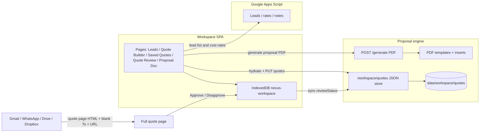
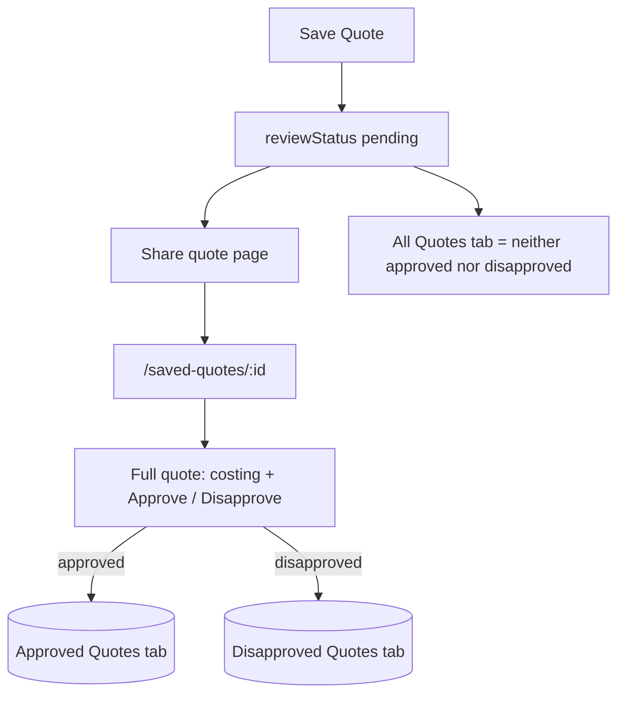

# WEOTT Nexus architecture

Nexus is a React workspace SPA plus a Flask proposal engine. Quotes live in the browser database and are mirrored as JSON on the engine so every session can load the same list.

## Runtime pieces

| Layer | Location | Role |
| --- | --- | --- |
| UI pages | `src/pages` | Routes for leads, quote builder, saved quotes, quote review, proposal PDF, settings |
| Components | `src/components` | Shared UI: cost accordion, quote document, share buttons, lead timeline |
| Domain libs | `src/lib` | Costing, prefill, share, review status, IndexedDB, cloud sync |
| Browser DB | IndexedDB `nexus-workspace` v3 | `savedQuotes` (indexed by `leadKey`, `savedAt`, `reviewStatus`), leads, proposals |
| Engine workspace | `workspace_store.py` | JSON quote files including `reviewStatus` / `reviewedAt` |
| PDF engine | Flask `/generate` | Overlay-only proposal PDFs from templates |

## Quote share contract

- Attachment is the **quote page** (HTML snapshot of the full quote), not a proposal PDF and not a CSV.
- Gmail **To is blank** — never the lead or contact email.
- The link opens `/saved-quotes/:id`, the full quote with **Approve Quote** and **Disapprove Quote**.
- Saved Quotes toggles: **All Quotes** (pending), **Approved Quotes**, **Disapproved Quotes**.

## Data flow for review status

1. New saves default to `pending`.
2. Approve/Disapprove writes `reviewStatus` + `reviewedAt` to IndexedDB and `PUT /workspace/quotes/:id`.
3. Sync merges form snapshots by `savedAt` and review fields by `reviewedAt`, so a later approval is not overwritten by an older costing save.
